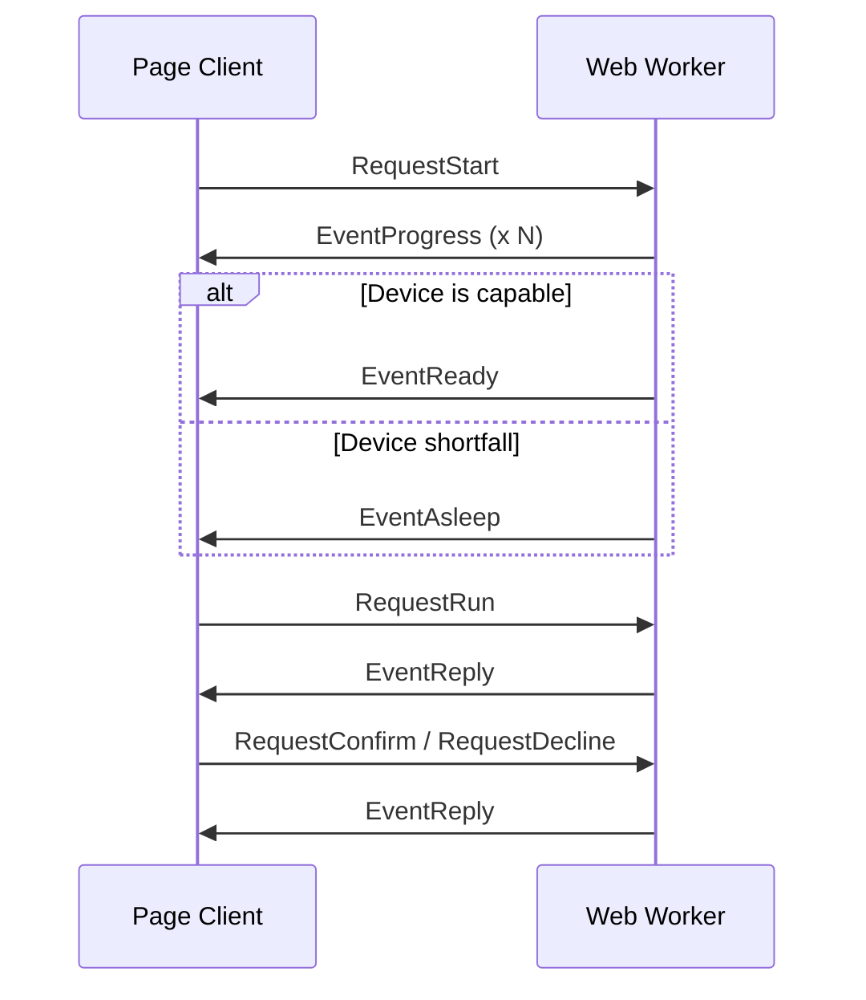

# Architecture

## Communication Sequence

## Degrade Order

If the device lacks space or computing rate, the writer model is dropped first (D-PWA-2). If the writer is dropped, `WriterOff` is true in the `EventReady`, and the assistant answers using templates/data instead.

## Decision Cache

Saved once per start (D27).

## Pruning

After a successful start, older artifact versions are removed (D-PWA-8) to save OPFS space.

## Why a Custom Worker Binary

The application must build its own Worker binary because its specific in-process tools, templates, memory adapters, and ID generators live in the application code, not in the `agentworker` library.
