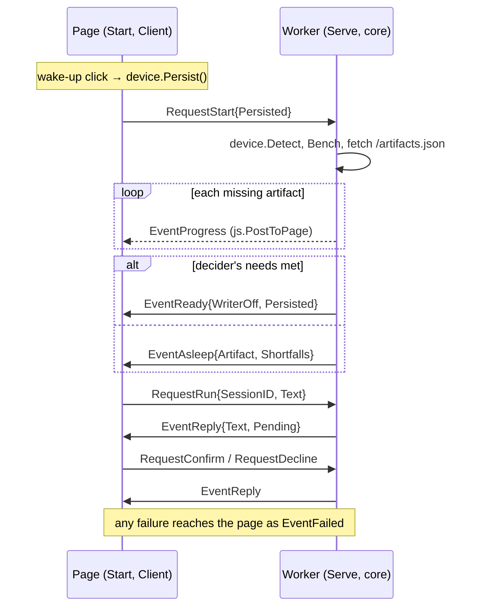

# Architecture

Decisions: [PWA_ARTIFACTS_MASTER_PLAN.md](https://github.com/webtyp/app/blob/main/docs/PWA_ARTIFACTS_MASTER_PLAN.md)
(D-PWA-2, 3, 8, 9, 10, 17) and the agent wave
[AGENT_ECOSYSTEM_MASTER_PLAN.md](https://github.com/webtyp/agent/blob/main/docs/AGENT_ECOSYSTEM_MASTER_PLAN.md)
(D10, D16, D25, D27).

## Page ↔ Worker

Messages are JSON (`webtyp.com/json`), one request at a time (`js.ServeWorker`). The reply to a
request is its event; progress and non-fatal failures travel outside replies with `js.PostToPage`.

## Degrade order (D-PWA-2, D-PWA-3)

1. The **writer** is dropped (`WriterOff`) when its `needs` have a blocking shortfall, when free
   space does not hold what both models still need, or when its download hits `ErrNoSpace`.
2. The assistant **sleeps** (`EventAsleep`) when the decider's `needs` have a blocking shortfall or
   its download hits `ErrNoSpace`. Nothing is downloaded in that case.

Memory is advisory only (`device.ShortMemory` does not block).

## Decision cache (D27)

`decision.cache` in the module's OPFS directory. Loaded after the decider opens; a cache the model
refuses (other weights) is deleted. When none was loaded, it is saved after the first reply whose
decision filled it — once per Worker start, since the tool list does not change while it lives.

## Versions (D-PWA-8)

`artifacts.Store.Prune` runs only after the agent is built, keeping the artifacts in use: an older
version stays until the new one works.

## Why the application builds the Worker binary

The agent's in-process tools, templates, memory and ID generator are application code. The Worker
binary is the application's `main` calling `Serve`; this library only wires models, storage and
messages around it.
